# Building the frame

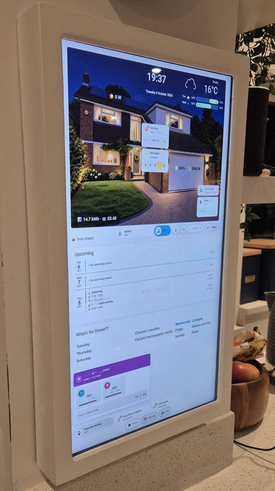

The frame turns a portable touchscreen into something that looks like a picture on the wall. It's made entirely from 6mm MDF, and it's built in two parts so the screen can come back out if you ever need to get at it:

- **The hood** - the face panel and four side strips, glued into one piece
- **The back** - a back panel that hangs on the wall on keyhole slots, with the monitor mounted to it

The hood drops over the back and fixes on with two countersunk screws, one at the top and one at the bottom.

**Total cost:** about £14 of MDF, plus glue, filler and paint.

## Tools

- Jigsaw
- Drill with a pilot bit, plus a bit large enough to get the jigsaw blade in
- Straight edge and clamps
- Hand router with a 45° chamfer bit
- Sanding block and files
- Calipers, or a good steel rule

## Materials

- 6mm MDF sheet
- Wood glue
- 2 short countersunk screws for fixing the hood
- 4 screws for hanging the back panel on the wall
- VESA screws longer than the ones supplied with the monitor (see Step 6)

You don't need a VESA wall bracket. The monitor screws straight onto the back panel, and the back panel hangs on the wall.
- Wood filler
- Primer and paint
- Felt or foam tape

## Step 1 - Measure your monitor first

Don't trust the spec sheet. Measure the actual monitor with calipers, because there's almost no tolerance in this design.

Mine measured:

| | |
|---|---|
| Monitor body | 302 x 506 x 33mm |
| Bezel | 15mm left, top and bottom; **19mm right** |
| Visible display | 268 x 476mm |

Two things to look out for:

- **An uneven bezel.** Mine sits 2mm off-centre, so I sized everything around the **display** rather than the monitor body. That way the picture looks dead centre in the frame.
- **An uneven depth.** Portable monitors are often thicker on one side, where the VESA mount and electronics sit. On mine, the mount side is 22mm thicker than the other side. You'll need to pack out the thin side so the screen sits flat (see Step 6).

Note where the buttons and ports are as well. You'll need cut-outs in the side strips to reach them.

## Step 2 - Work out your dimensions

These are my dimensions. If your monitor is different, use the formulas to adapt them.

| Part | My size | Formula |
|---|---|---|
| Window | 270 x 478mm | Display + 2mm (1mm bezel reveal all round) |
| Face panel | 320 x 528mm | Window + 2 x border (I used 25mm) |
| Side strips - left and right (x2) | 528 x 45mm | Length = face height |
| Side strips - top and bottom (x2) | 308 x 45mm | Length = face width - 2 x 6mm |
| Strip depth | 45mm | Back panel + spacer + monitor depth (6 + 6 + 33) |
| Back panel | 306 x 514mm | Internal opening - 2mm |

**Total depth:** 51mm (45mm strips + 6mm face).

**Symmetry check:** with the monitor positioned as in Step 6, the display sits 26mm from every outer edge of the frame, behind a 25mm border. That leaves a 1mm strip of bezel showing all round, so it looks even.

**A note on clearance:** with a 25mm border, there's only about 5mm around the monitor on three sides and 1mm on the right. It's tight but it works. If you want more room, a 30mm border (330 x 538mm face) gives you about 10mm on three sides and 6mm on the right.

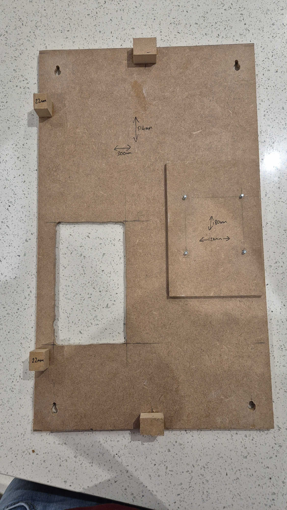

## Step 3 - Cut the face panel and window

Cut the window out of a single piece of MDF rather than making the face from four mitred strips. Mitre joints in 6mm MDF have almost no glue area, they're hard to get perfectly square, and they tend to crack or ghost through the paint over time as the MDF moves with heat and humidity.

1. Cut the face panel to size and mark the window 25mm in from every edge.
2. Drill a hole in each inside corner, just inside the line, so the jigsaw blade can get in.
3. Clamp a straight edge along each side as a fence, and cut a millimetre or so inside the line.
4. Sand or file back to the line, and square up the corners with a file.

The borders are flexible until the face is glued to the sides, so support the sheet well while you're cutting and don't lift it by one border.

## Step 4 - Chamfer the window

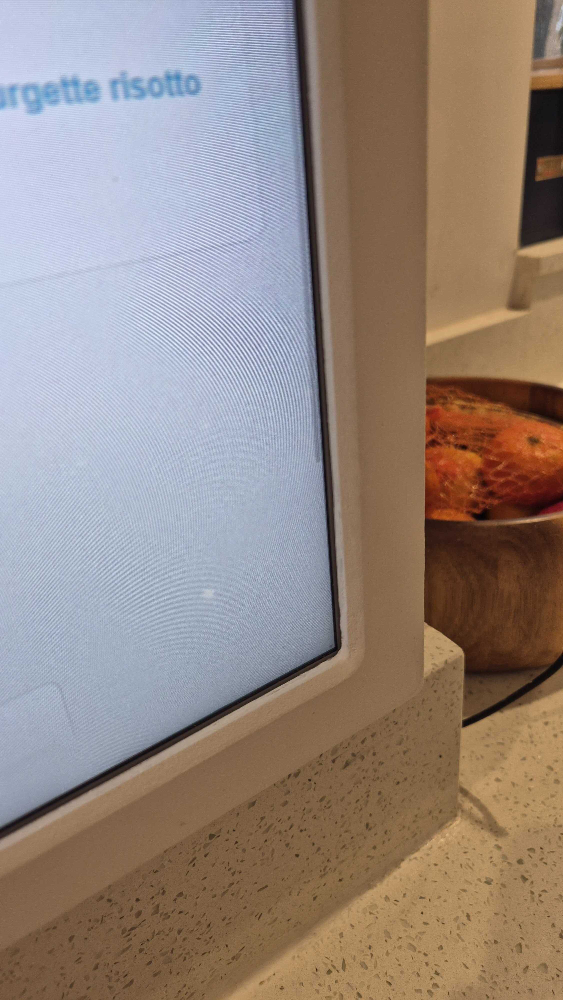

Run a 45° chamfer around the inside edge of the window with a hand router. This is what gives it a proper picture-frame look, and it softens the step down to the screen.

Do a test pass on an offcut first to get the depth right.

## Step 5 - Build the hood

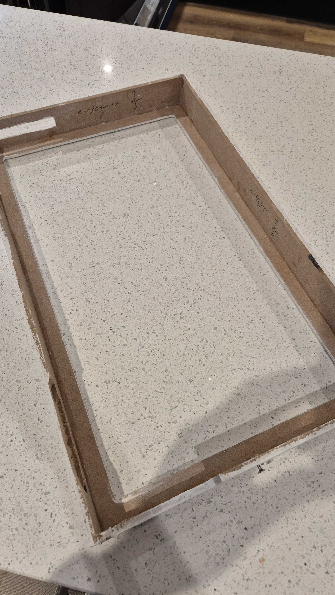

The side strips use butt joints, not mitres. The long sides run the full length, and the top and bottom pieces fit between them.

1. Cut the side strips: two at 528 x 45mm and two at 308 x 45mm.
2. Cut the access holes before you glue anything. I have cable cut-outs in the bottom strip and a cut-out in the top strip so I can still reach the monitor's buttons. Hold each strip against the monitor to mark them.
3. Glue the four strips into a rectangle, with the short pieces between the long ones.
4. Glue the face panel on top, flush with the outside edges. The face covers the front of the joints, so the only visible join is a thin line on the top and bottom surfaces.
5. Clamp and check it's square before the glue sets, by measuring both diagonals.

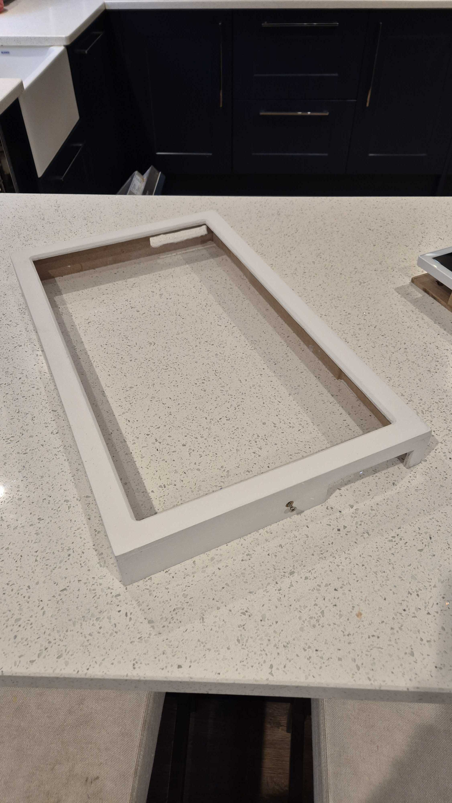

## Step 6 - Build the back and mount the monitor

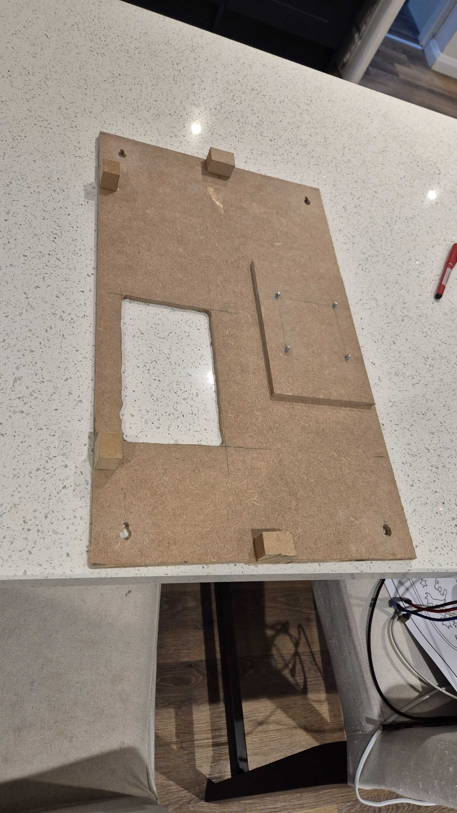

The back panel replaces a VESA wall bracket. The monitor screws straight onto it, and it hangs on the wall.

**Why not use a VESA bracket?** In portrait, the monitor's VESA mounting points are off-centre, so the weight pulls it crooked on a slimline bracket. I tried one and couldn't get it to hang straight. Screwing the monitor to a flat MDF panel that's fixed to the wall at all four corners solves that completely.

1. Cut the back panel to 306 x 514mm.
2. Cut a large opening for the mini PC. Mine sits in a recess in the wall behind the screen, so the opening gives access to it and lets the cables through.
3. Cut a keyhole slot near each corner so the panel can hang on screws in the wall.
4. Glue a smaller 6mm MDF spacer to the front of the panel where the monitor's VESA mount will sit. Drill the VESA holes through the panel and spacer, and fit the screws from the back so they stick out through the front. The screws supplied with the monitor won't be long enough for this, so get some longer ones.
5. Glue small MDF blocks around the edges of the panel to support the thin side of the monitor (see below). Put one block at the centre of the top edge and one at the centre of the bottom edge, as these double as the fixing points for the hood.
6. Screw the monitor onto the VESA screws, positioned 4mm from the top, bottom and left edges and flush with the right edge (viewed from the front). This offset compensates for the uneven bezel.

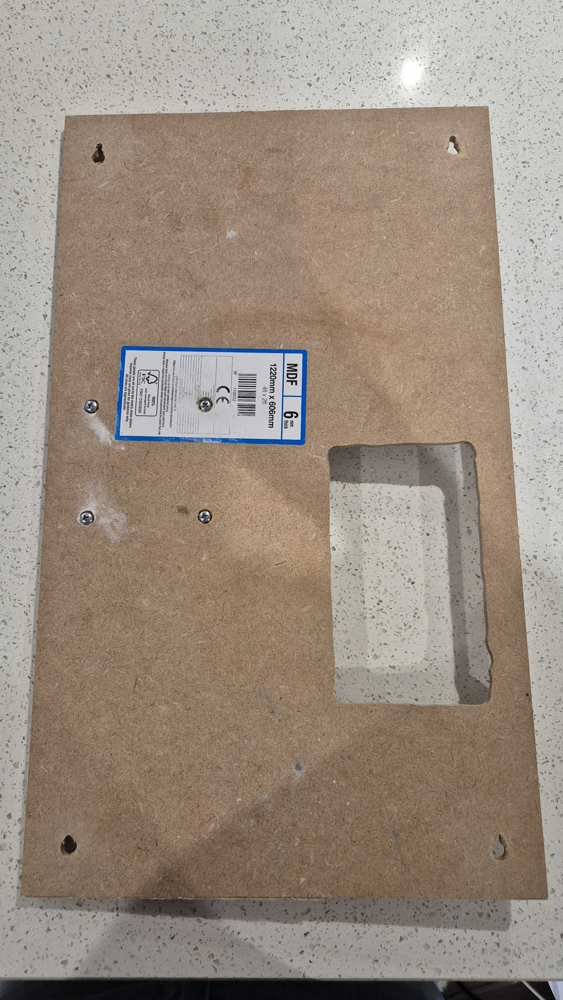

**Keeping the monitor flat.** Because the mount side of my monitor is 22mm thicker than the other side, screwing it on through the VESA mount alone would leave it tilted. The 22mm blocks hold up the thin side, so the monitor rests flat and the screen sits parallel to the face of the frame.

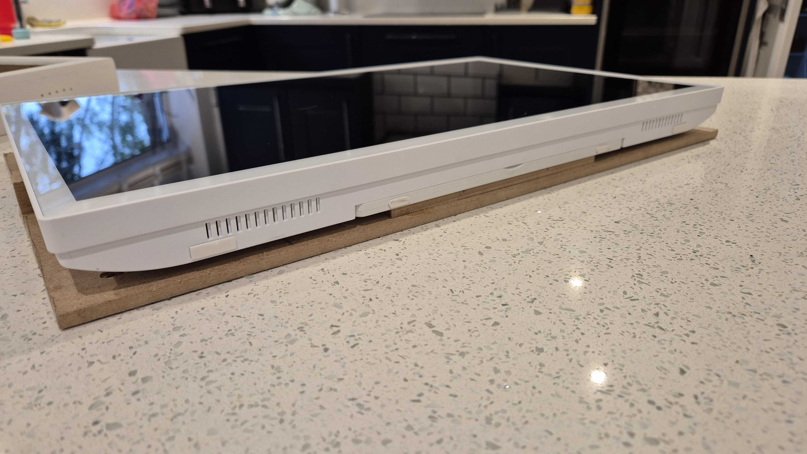

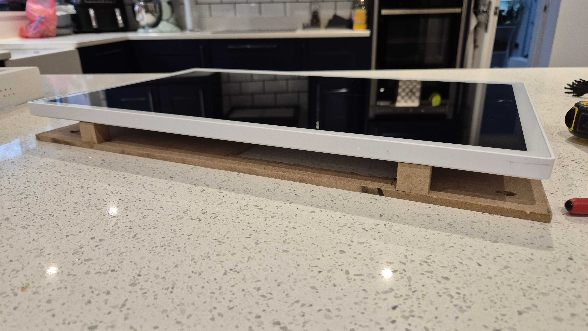

## Step 7 - Finish the hood

1. Fill the joins and any screw holes, then sand smooth.
2. Prime before painting. MDF edges soak up paint, so they may need an extra coat.
3. Paint the hood. <!-- TODO: add the paint and finish you used -->
4. Put felt or foam tape on the inside of the face where it meets the screen, so there's no pressure on the LCD.

## Step 8 - Fit it to the wall

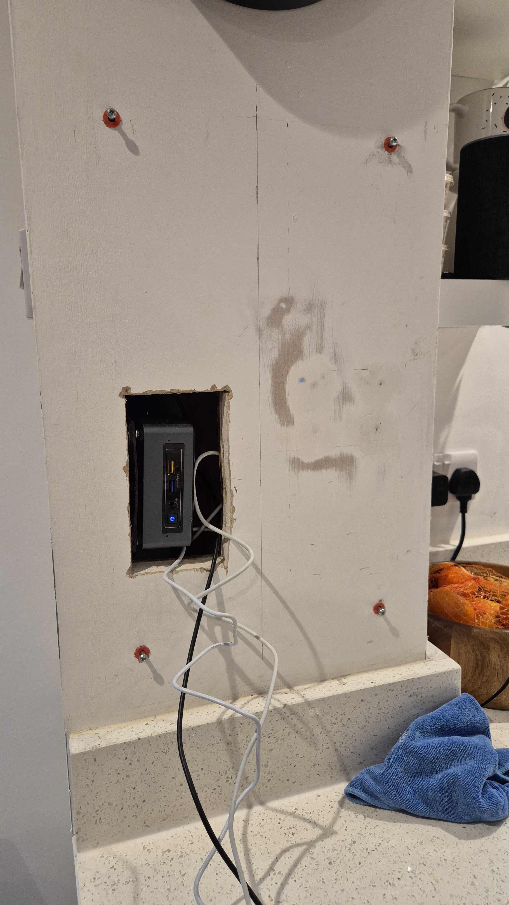

1. Fit the mini PC into the wall recess and run the power and video cables.
2. Put four screws into the wall, lined up with the keyhole slots in the back panel. Leave the heads standing proud enough for the slots to drop over them.
3. Hang the back panel and monitor on the screws, then connect the cables through the PC opening.
4. Drop the hood over the back assembly.
5. Fix the hood with two countersunk screws, one through the centre of the top strip and one through the bottom, into the MDF blocks on the back panel. Drill pilot holes first, because thin MDF splits easily, and countersink them so the screw heads sit flush.

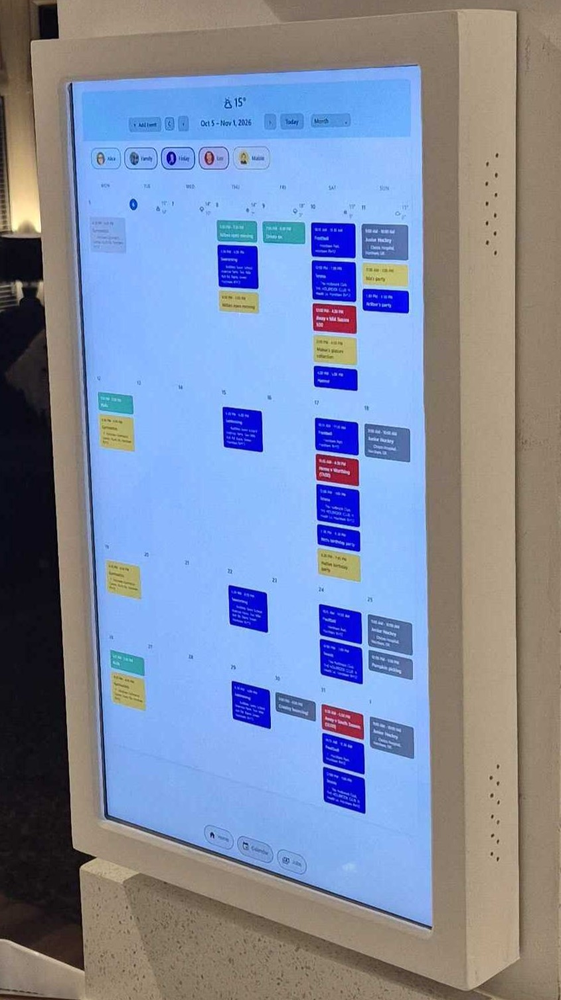
